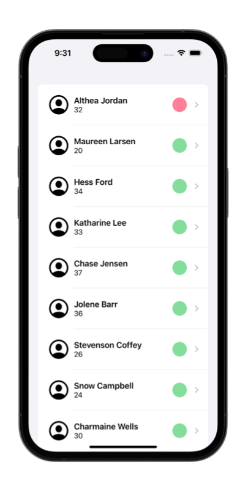
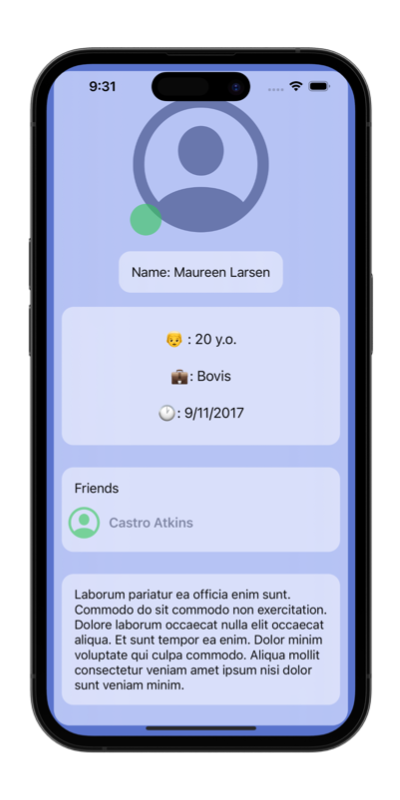
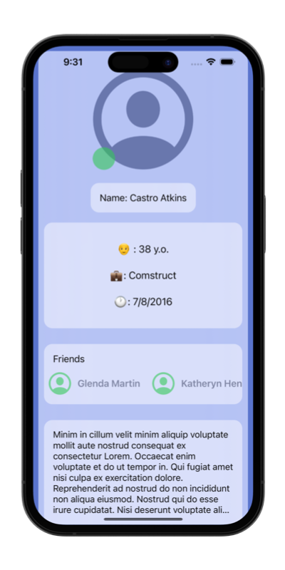

# &nbsp; Milestone 4

##### Author: *[MatviiArtemenko](https://github.com/100DaysOfSwiftUI-MatviiArtemenko)*

##### 100DaysOfSwiftUI form *[@twostraws](https://twitter.com/twostraws "twostraws twitter page")*

##### Follow along: *[100DaysOfSwiftUI](https://www.hackingwithswift.com/100/swiftui "Hacking with Swift")*

---
From *[100DaysOfSwiftUI :](https://www.hackingwithswift.com/100/swiftui "Hacking with Swift")*
> *It’s time for you to build an app from scratch, and it’s a particularly expansive challenge today: your job is to use URLSession to download some JSON from the internet, use Codable to convert it to Swift types, then use NavigationView, List, and more to display it to the user. *

---
## &nbsp; 🎖 Challenge
> How far you implement this is down to you, but at the very least you should:
> + Fetch the data and parse it into `User` and `Friend` structs.
> + Display a list of users with a little information about them, such as their name and whether they are active right now.
> + Create a detail view shown when a user is tapped, presenting more information about them, including the names of their friends.
> + Before you start your download, check that your `User` array is empty so that you don’t keep starting the download every time the view is shown.
 

---
## &nbsp; 📲 Screenshoot

  
  
  

---
##  &nbsp; 🔍 &nbsp; Resources 

> * Your first step should be to examine the JSON. The URL you want to use is this: https://www.hackingwithswift.com/samples/friendface.json – that’s a massive collection of randomly generated data for example users.
* [Hacking With Swift](https://www.hackingwithswift.com/books/ios-swiftui)
* [Apple documentation](https://developer.apple.com/documentation/SwiftUI)
